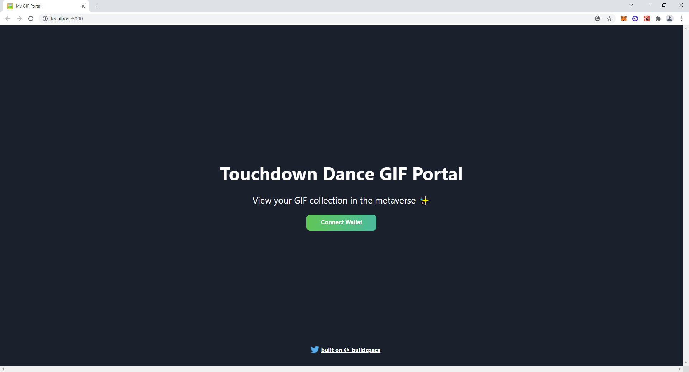
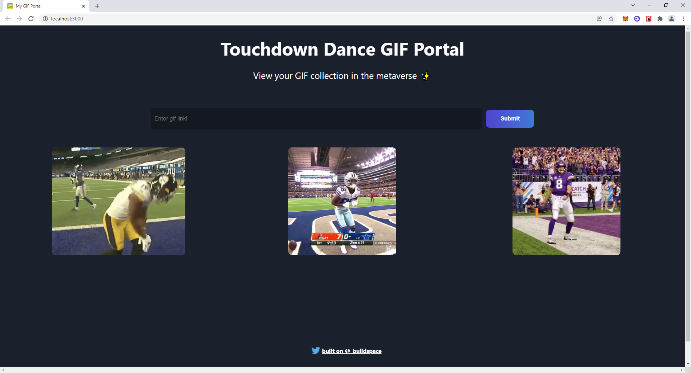

My first Web3 app on Solana - built with React and Rust. Thank you buildspace!

Deployed on devnet:
https://explorer.solana.com/address/DacbdoRTd85dRZwfWJopbhRm7G8AWCqe9Sm53xPQauCi?cluster=devnet 

A few notes from the buildspace lesson:

Programs - 
On Solana, we write "Solana programs". Note: This is sorta like a smart contract if you know about Ethereum! A Solana program is just a piece of code that lives on the blockchain. The blockchain is a place where anyone can run code for a fee. You can think of the blockchain like AWS or Heroku. But, instead of being run by a big corporation these chains are run by "miners". In the world of Solana we actually call them "validators".

Accounts - 
On Solana, programs are "stateless". This is very different from Ethereum. On Ethereum, you write "smart contracts" and contracts actually maintain state where you can actually store data on variables directly on the contracts. Users have "accounts" and Solana programs can interact with "accounts" users own. One user can own 1000s of accounts. The easiest way to think of an account is sort of like a file. Users can have many different files. Developers can write programs that can talk to these files. The program itself doesn't hold a user's data. The program just talks to "accounts" that hold the user's data.

We're going to kick things off w/ one of the most magical things about web3, connecting to a product with your wallet. We'll allow our user to essentially "auth" with their Solana wallet. Building auth is usually pretty hard. You need to have a database of usernames, password, etc. Remember, it's just like authenticating into a website. If you aren't "logged in" to G-Mail, then you can't use their email product!

We're going to build a Solana program that lets users 1) submit gifs to the board 2) have them saved on the Solana blockchain 3) retrieve all the GIFs that have been submitted.

Connect Wallet:

Post GIF - only if connected:

